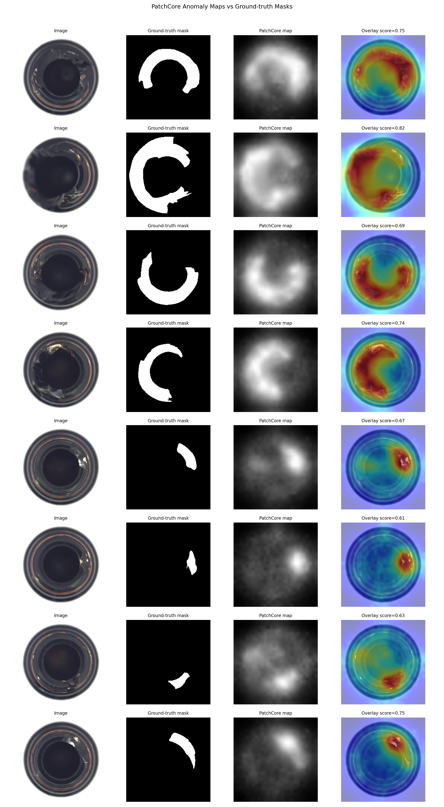

<p align="right">
  <a href="README.md">English</a> |
  <a href="README.zh-CN.md">中文</a>
</p>

# Industrial Parts Defect Detection with Explainable Deep Learning

This project builds an industrial visual inspection pipeline on the `bottle` category of the MVTec AD dataset. It starts with a supervised defect classifier and extends the workflow with Grad-CAM based explainability, PatchCore unsupervised anomaly detection, and mask-level localization analysis.

The task is binary image classification:

- `good = 0`
- `defect = 1`

Beyond classification accuracy, the project also checks whether the model focuses on the real defective regions provided by MVTec ground-truth masks.

## Highlights

- Reproducible data checking and metadata-based train/validation/test split
- ResNet18 transfer learning with class-weighted loss for imbalanced data
- Evaluation with accuracy, precision, recall, F1-score, confusion matrix, and per-defect-type recall
- Grad-CAM visualization for model attention analysis
- PatchCore anomaly detection trained only on normal images
- Mask-level localization metrics using MVTec ground-truth masks
- Visual reports for correct predictions, failure cases, and defect heatmap overlays

## Dataset

Dataset: MVTec AD

Category: `bottle`

Expected local structure:

```text
data/
└── bottle/
    ├── ground_truth/
    ├── test/
    └── train/
```

Checked data counts:

| Split | Type | Count |
| --- | --- | ---: |
| train | good | 209 |
| test | good | 20 |
| test | broken_large | 20 |
| test | broken_small | 22 |
| test | contamination | 21 |

The `data/` directory is ignored by Git and should not be committed.

## Experiment Design

MVTec AD is primarily designed for anomaly detection:

- training data contains only normal images
- test data contains both normal and defective images
- defective images include pixel-level masks

This repository uses the dataset in two ways:

1. **Supervised binary classification:** a fixed metadata split assigns some defective samples to train/validation/test.
2. **Explainability and localization analysis:** Grad-CAM heatmaps are compared with MVTec ground-truth masks on test defects.
3. **Unsupervised anomaly detection:** PatchCore builds a memory bank from `train/good` only, selects a threshold on `val/good`, and evaluates on the test split.

Default split rule:

- 80% of `train/good` goes to training
- 20% of `train/good` goes to validation
- all `test/good` images stay in the test split
- for each defect type, 60% goes to training, 20% to validation, and the rest to testing
- random seed: `42`

Current experiment split:

| Experiment Split | Good | Defect | Total |
| --- | ---: | ---: | ---: |
| train | 167 | 38 | 205 |
| val | 42 | 12 | 54 |
| test | 20 | 13 | 33 |

## Project Structure

```text
.
├── data/
│   └── bottle/
├── src/
│   ├── check_data.py
│   ├── compare_methods.py
│   ├── dataset.py
│   ├── evaluate.py
│   ├── explain.py
│   ├── model.py
│   ├── patchcore.py
│   ├── run_patchcore.py
│   ├── train.py
│   └── visualize.py
├── results/
│   ├── confusion_matrix.png
│   ├── gradcam_mask_overlay.png
│   ├── sample_predictions.png
│   └── misclassified_samples.png
├── README.md
├── README.zh-CN.md
├── pyproject.toml
└── requirements.txt
```

## Environment Setup

This project uses `uv`.

```bash
uv sync
```

The default configuration installs the CPU version of PyTorch, which is enough for this dataset-scale experiment.

## How To Run

### 1. Check Data And Create Metadata

```bash
uv run python src/check_data.py --data_dir data/bottle
```

Outputs:

```text
results/data_check.csv
results/metadata.csv
```

### 2. Train

```bash
uv run python src/train.py --epochs 10 --batch_size 16
```

Outputs:

```text
results/best_model.pth
results/train_log.csv
```

The model uses ImageNet-pretrained ResNet18 and replaces the final fully connected layer with a 2-class classifier.

If pretrained weight download is unavailable, run:

```bash
uv run python src/train.py --epochs 10 --batch_size 16 --no_pretrained
```

### 3. Evaluate Classification

```bash
uv run python src/evaluate.py
```

Outputs:

```text
results/metrics.json
results/predictions.csv
results/confusion_matrix.png
```

### 4. Visualize Predictions

```bash
uv run python src/visualize.py
```

Outputs:

```text
results/sample_predictions.png
results/misclassified_samples.png
```

### 5. Generate Grad-CAM And Localization Metrics

```bash
uv run python src/explain.py --max_visualizations 8
```

Outputs:

```text
results/gradcam_localization.csv
results/localization_metrics.json
results/gradcam_mask_overlay.png
```

The script computes Grad-CAM for the defect class and compares the normalized heatmap with pixel-level ground-truth masks using IoU, Dice, pointing-hit rate, and inside/outside-mask activation.

### 6. Run PatchCore Anomaly Detection

PatchCore is independent from the supervised classifier. You do **not** need to run `src/train.py` first, and `src/run_patchcore.py` does **not** load `results/best_model.pth` or any MVTec-supervised checkpoint. The memory bank is built from `train/good` only, and the threshold is selected from `val/good` only.

```bash
uv run python src/run_patchcore.py --batch_size 4 --coreset_ratio 0.05 --max_visualizations 8
```

Outputs:

```text
results/patchcore/patchcore_metrics.json
results/patchcore/patchcore_predictions.csv
results/patchcore/patchcore_localization.csv
results/patchcore/patchcore_heatmaps.png
results/patchcore/patchcore_score_distribution.png
results/patchcore/anomaly_maps/
```

PatchCore uses frozen ImageNet-pretrained ResNet18 intermediate features by default. This is common for PatchCore and does not use any MVTec defect labels. The reported results above are based on this default pretrained backbone.

If pretrained weight download is unavailable, or if you want a strictly non-pretrained backbone, run:

```bash
uv run python src/run_patchcore.py --no_pretrained
```

`--no_pretrained` is only a fallback or ablation setting. It uses random frozen ResNet18 features, so the anomaly scores and recall can be much worse than the default PatchCore run.

### 7. Compare Methods Under One Report Format

```bash
uv run python src/compare_methods.py
```

Outputs:

```text
results/method_comparison.csv
results/method_comparison.md
```

This report compares the supervised ResNet18 classifier and the unsupervised PatchCore anomaly detector with the same image-level and localization-level metrics.

## Results

### Unified Method Comparison

| Method | Learning setting | Training data used | Defect labels used for training | Supervised checkpoint used | Accuracy | Precision | Recall | F1-score | Localization IoU | Localization Dice | Pointing-hit rate | Main heatmap |
| --- | --- | --- | --- | --- | ---: | ---: | ---: | ---: | ---: | ---: | ---: | --- |
| ResNet18 classifier + Grad-CAM | Supervised binary classification | train/good + train/defect | Yes | Yes | 0.939 | 1.000 | 0.846 | 0.917 | 0.216 | 0.321 | 0.538 | Grad-CAM |
| PatchCore anomaly detector | Unsupervised normal-only anomaly detection | train/good | No | No | 0.939 | 0.923 | 0.923 | 0.923 | 0.403 | 0.555 | 1.000 | PatchCore anomaly map |

The comparison shows a useful trade-off: the supervised classifier has perfect precision on this split, while PatchCore improves recall and localization without using defect labels for training.

Current classification results on the test split:

| Metric | Value |
| --- | ---: |
| Accuracy | 0.939 |
| Precision | 1.000 |
| Recall | 0.846 |
| F1-score | 0.917 |

Per-defect-type recall:

| Defect Type | Recall |
| --- | ---: |
| broken_large | 1.000 |
| broken_small | 1.000 |
| contamination | 0.500 |

Localization analysis on 13 masked defective test samples:

| Metric | Value |
| --- | ---: |
| Mean CAM IoU | 0.216 |
| Mean CAM Dice | 0.321 |
| Pointing-hit rate | 0.538 |
| Mean CAM activation inside mask | 0.620 |
| Mean CAM activation outside mask | 0.230 |

PatchCore unsupervised anomaly detection results:

| Metric | Value |
| --- | ---: |
| Accuracy | 0.939 |
| Precision | 0.923 |
| Recall | 0.923 |
| F1-score | 0.923 |
| Threshold | 0.450 |
| Memory bank size | 6546 |
| Supervised MVTec checkpoint used | No |

PatchCore localization analysis on 13 masked defective test samples:

| Metric | Value |
| --- | ---: |
| Mean anomaly IoU | 0.403 |
| Mean anomaly Dice | 0.555 |
| Pointing-hit rate | 1.000 |
| Mean anomaly inside mask | 0.777 |
| Mean anomaly outside mask | 0.252 |

## Visual Reports

### Confusion Matrix


### Prediction Samples


### Failure Cases


### Grad-CAM And Ground-truth Mask Overlay


### PatchCore Anomaly Heatmaps



## Industrial Value

This project simulates a practical visual quality inspection workflow:

- automatically identify abnormal product appearance
- evaluate false positives and missed defects with precision and recall
- inspect weak defect categories through per-type recall
- use Grad-CAM to review whether the model attends to meaningful regions
- use PatchCore to detect defects without training on defective samples
- compare supervised classification and anomaly detection with the same report schema
- compare model attention against ground-truth defect masks for localization analysis
- provide a foundation for anomaly detection, defect localization, and deployment demos

## Next Steps

- Tune PatchCore coreset selection, thresholding, and feature layers
- Extend the pipeline to `metal_nut`, `capsule`, and other MVTec categories
- Build a Streamlit or Gradio inspection demo with uploaded image inference and heatmap overlay
