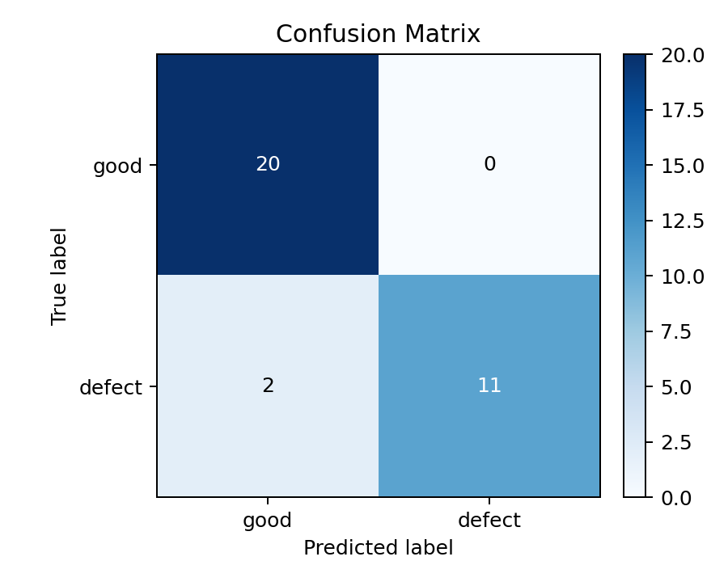
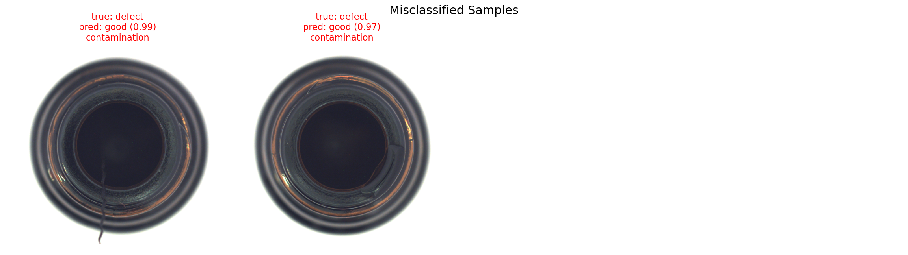
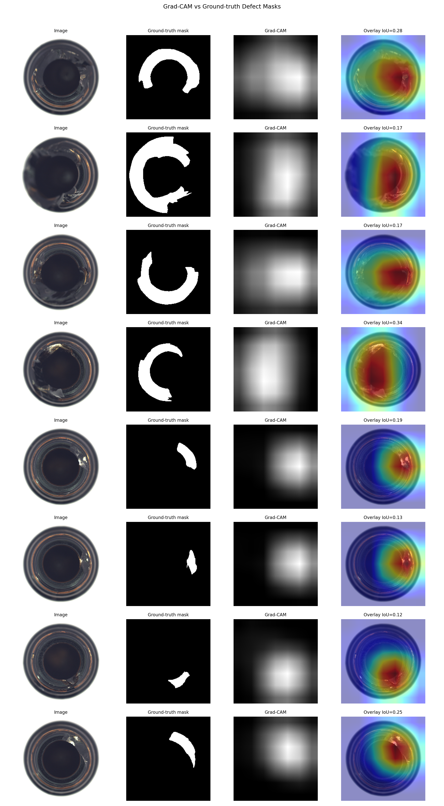

<p align="right">
  <a href="README.md">English</a> |
  <a href="README.zh-CN.md">中文</a>
</p>

# 基于可解释深度学习的工业零件缺陷检测

本项目基于 MVTec AD 数据集中的 `bottle` 类别，构建一个工业视觉质检流程。项目从监督式缺陷二分类模型开始，并进一步加入 Grad-CAM 可解释性分析和基于真实 mask 的缺陷定位评估。

分类任务定义为：

- `good = 0`
- `defect = 1`

除了分类准确率，项目还会分析模型是否真正关注到了 MVTec 提供的真实缺陷区域。

## 项目亮点

- 可复现的数据检查与基于 metadata 的训练/验证/测试划分
- 使用 ResNet18 迁移学习，并通过 class-weighted loss 缓解类别不平衡
- 输出 Accuracy、Precision、Recall、F1-score、混淆矩阵和分缺陷类型召回率
- 使用 Grad-CAM 生成模型关注区域热力图
- 使用 MVTec ground-truth mask 做像素级定位评估
- 生成正确预测、错误样本和缺陷热力图叠加等可视化报告

## 数据集

数据集：MVTec AD

类别：`bottle`

本地目录结构：

```text
data/
└── bottle/
    ├── ground_truth/
    ├── test/
    └── train/
```

已检查的数据数量：

| Split | Type | Count |
| --- | --- | ---: |
| train | good | 209 |
| test | good | 20 |
| test | broken_large | 20 |
| test | broken_small | 22 |
| test | contamination | 21 |

`data/` 目录已被 Git 忽略，不应提交到 GitHub。

## 实验设计

MVTec AD 官方设定更偏向异常检测：

- 训练集通常只包含正常样本
- 测试集包含正常样本和缺陷样本
- 缺陷样本提供像素级 ground-truth mask

本项目以两种方式使用该数据集：

1. **监督式二分类实验：** 通过固定 metadata 划分，将部分缺陷样本分配到训练集、验证集和测试集。
2. **可解释性与定位分析：** 在测试集缺陷样本上，将 Grad-CAM 热力图与真实缺陷 mask 进行对比。

默认划分规则：

- `train/good` 中 80% 进入训练集
- `train/good` 中 20% 进入验证集
- `test/good` 全部保留为测试集
- 每个缺陷类型中 60% 进入训练集，20% 进入验证集，其余进入测试集
- 随机种子：`42`

当前实验划分：

| Experiment Split | Good | Defect | Total |
| --- | ---: | ---: | ---: |
| train | 167 | 38 | 205 |
| val | 42 | 12 | 54 |
| test | 20 | 13 | 33 |

## 项目结构

```text
.
├── data/
│   └── bottle/
├── src/
│   ├── check_data.py
│   ├── dataset.py
│   ├── evaluate.py
│   ├── explain.py
│   ├── model.py
│   ├── train.py
│   └── visualize.py
├── results/
│   ├── confusion_matrix.png
│   ├── gradcam_mask_overlay.png
│   ├── sample_predictions.png
│   └── misclassified_samples.png
├── README.md
├── README.zh-CN.md
├── pyproject.toml
└── requirements.txt
```

## 环境安装

本项目使用 `uv`。

```bash
uv sync
```

默认配置安装 CPU 版本 PyTorch。对于当前数据规模和项目展示已经足够。

## 运行流程

### 1. 数据检查与 metadata 生成

```bash
uv run python src/check_data.py --data_dir data/bottle
```

输出：

```text
results/data_check.csv
results/metadata.csv
```

### 2. 训练模型

```bash
uv run python src/train.py --epochs 10 --batch_size 16
```

输出：

```text
results/best_model.pth
results/train_log.csv
```

模型使用 ImageNet 预训练 ResNet18，并将最后的全连接层替换为 2 分类层。

如果无法下载预训练权重，可以运行：

```bash
uv run python src/train.py --epochs 10 --batch_size 16 --no_pretrained
```

### 3. 分类评估

```bash
uv run python src/evaluate.py
```

输出：

```text
results/metrics.json
results/predictions.csv
results/confusion_matrix.png
```

### 4. 生成预测可视化

```bash
uv run python src/visualize.py
```

输出：

```text
results/sample_predictions.png
results/misclassified_samples.png
```

### 5. 生成 Grad-CAM 与定位指标

```bash
uv run python src/explain.py --max_visualizations 8
```

输出：

```text
results/gradcam_localization.csv
results/localization_metrics.json
results/gradcam_mask_overlay.png
```

该脚本会针对 defect 类别生成 Grad-CAM，并将归一化热力图与真实 mask 对比，输出 IoU、Dice、pointing-hit rate 以及 mask 内外平均激活值。

## 实验结果

当前测试集分类结果：

| Metric | Value |
| --- | ---: |
| Accuracy | 0.939 |
| Precision | 1.000 |
| Recall | 0.846 |
| F1-score | 0.917 |

分缺陷类型召回率：

| Defect Type | Recall |
| --- | ---: |
| broken_large | 1.000 |
| broken_small | 1.000 |
| contamination | 0.500 |

在 13 张带 mask 的缺陷测试样本上的定位分析：

| Metric | Value |
| --- | ---: |
| Mean CAM IoU | 0.216 |
| Mean CAM Dice | 0.321 |
| Pointing-hit rate | 0.538 |
| Mean CAM activation inside mask | 0.620 |
| Mean CAM activation outside mask | 0.230 |

## 可视化报告

### 混淆矩阵



### 正确预测样本


### 错误样本分析



### Grad-CAM 与真实 mask 叠加



## 工业应用价值

该项目模拟了一个基础但完整的工业视觉质检流程：

- 自动识别产品外观异常
- 通过 Precision 和 Recall 分析误检与漏检风险
- 通过分缺陷类型召回率定位薄弱缺陷类别
- 使用 Grad-CAM 分析模型是否关注了合理区域
- 将模型关注区域与真实缺陷 mask 对比，评估定位能力
- 为后续异常检测、缺陷定位和交互式部署演示提供基础


## 后续优化方向

- 加入 AutoEncoder、PaDiM 或 PatchCore 等无监督异常检测 baseline
- 在统一报告格式下对比监督式分类和异常检测方法
- 扩展到 `metal_nut`、`capsule` 等更多 MVTec 类别
- 构建 Streamlit 或 Gradio 交互式质检 demo，支持上传图片、预测和热力图展示
